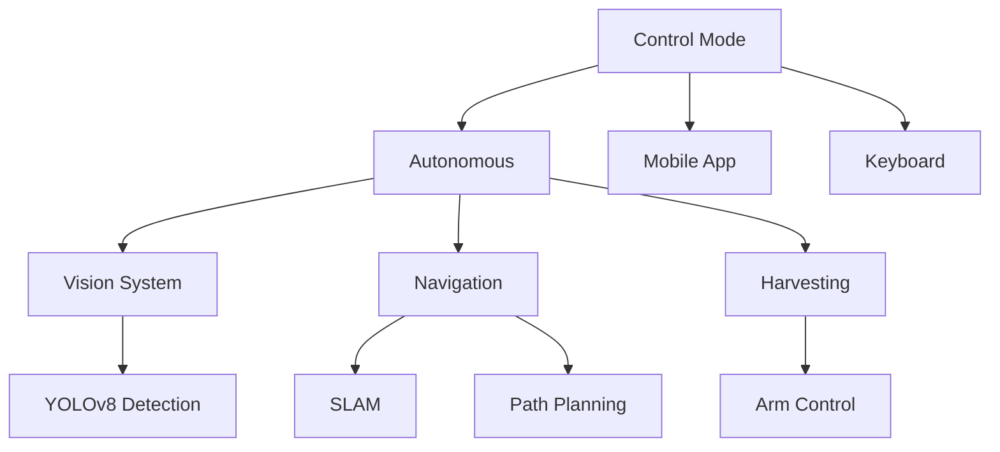
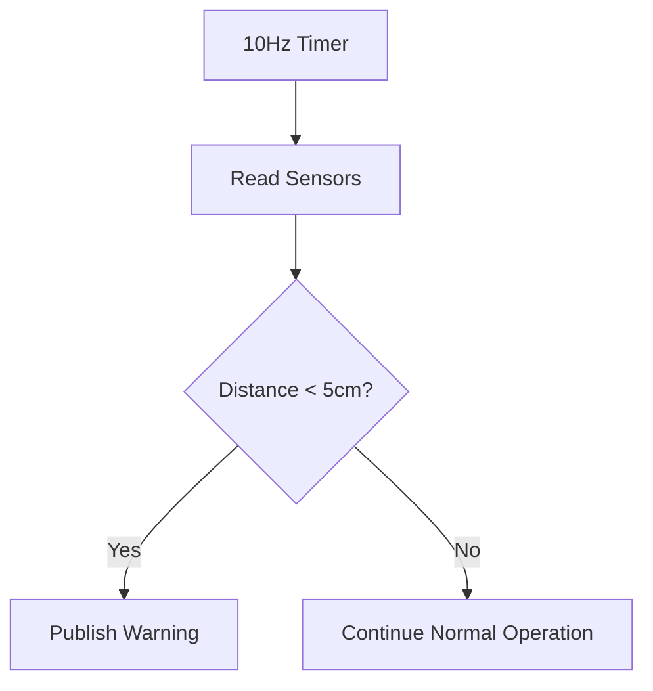
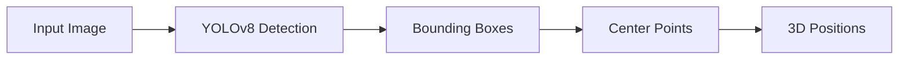
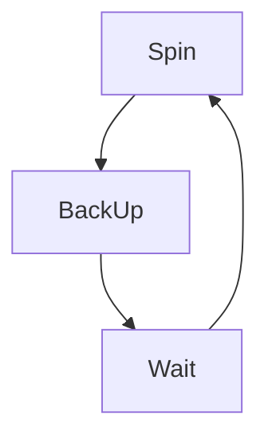
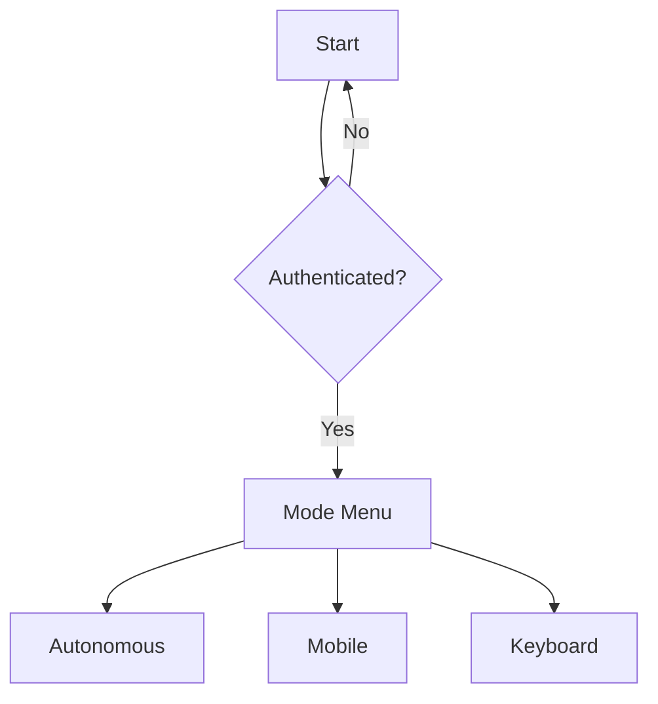
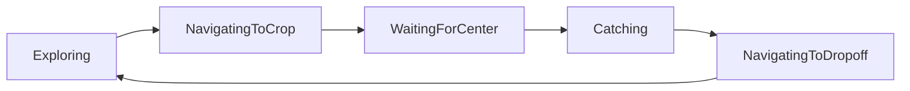

[](https://deepwiki.com/Marioemad1/farm_robot)

# Autonomous Agricultural Robotics System (ROS2 Framework)

## System Overview

This repository contains the implementation of an autonomous agricultural robot system built on the ROS2 framework. The system is designed for flexible operation through multiple control modes and integrates key subsystems to enable intelligent crop detection, autonomous navigation, and precision harvesting.

## Control Modes

The robot supports three primary modes of operation:

- **Autonomous:** Fully autonomous operation leveraging onboard sensors and processing.
- **Mobile App:** Remote control via a user-friendly mobile application.
- **Keyboard:** Direct manual control through a keyboard interface.

## Autonomous Mode Subsystems

In autonomous mode, the system coordinates three critical components:

- **Vision System:** Powered by the YOLOv8 deep learning model, this subsystem performs real-time crop detection, generating bounding boxes and localizing crops within the environment.
- **Navigation System:** Employs SLAM (Simultaneous Localization and Mapping) and path planning algorithms to enable accurate movement and obstacle avoidance.
- **Harvesting System:** Controls the robotic arm to pick crops identified by the vision system.

## Information Flow

Commands from the selected control mode are routed to the respective subsystems. The vision system processes sensor inputs and provides crop locations to the navigation and harvesting modules. The navigation system plans efficient routes and controls robot movement, while the harvesting system executes precise crop picking operations.
 


    
# Hardware Communication (`serial_communication.py`)

## Purpose

The serial communication node acts as the critical interface between high-level ROS2 commands and the Arduino-based motor and arm controllers. It translates ROS2 messages into serial commands that the microcontrollers interpret to drive the robot's actuators.

## Architecture Overview

- The ROS2 framework publishes movement commands on the `/cmd_vel` topic, which contains linear and angular velocity data.
- Arm control commands are published on the `/arm_command` topic.
- The serial communication node subscribes to these topics, formats the commands into simple serial strings, and transmits them over USB serial ports connected to the Arduino controllers.
- Motor commands are sent to the motor controller connected at `/dev/ttyUSB0`.
- Arm commands are sent to the arm controller connected at `/dev/ttyUSB1`.
- Communication uses a baud rate of 9600 to ensure reliable and low-latency transmission.

## Message Protocols

### Motor Commands

- **Format:** `VEL:<linear_velocity>,<angular_velocity>\n`
- **Example:** `VEL:0.2,0.1\n` commands the robot to move forward at 0.2 m/s with an angular velocity of 0.1 rad/s.

### Arm Commands

- **Format:** `ARM:<action>\n`
- **Examples:**
  - `ARM:catch\n` — closes the gripper to grab the crop.
  - `ARM:release\n` — opens the gripper to release the crop.


### Diagram:

```mermaid
flowchart LR
    ROS2[/cmd_vel/] --> SerialNode[Serial Communication Node]
    SerialNode -->|"VEL:<lin>,<ang>\\n"| Motors[/dev/ttyUSB0/]
    ROS2[/arm_command/] --> SerialNode
    SerialNode -->|"ARM:<cmd>\\n"| Arm[/dev/ttyUSB1/]
  ```
# Coordinate Frames (`tf_config.yaml`)

## Purpose

This configuration defines the spatial relationships between the robot’s various components by specifying their coordinate frames and transformations. These frames are essential for accurate sensor data fusion, navigation, and arm manipulation within the ROS2 `tf` (transform) framework.

## Transform Tree Overview

- **base_link:** The robot’s primary reference frame, typically centered on the chassis.
- **navigation_camera_link:** Frame representing the navigation camera, used primarily for SLAM and environmental perception, mounted at a fixed offset relative to `base_link`.
- **crop_camera_link:** Frame for the camera dedicated to crop detection, positioned to optimize crop visibility.

Maintaining these fixed transformations allows the system to precisely interpret sensor data and coordinate movements between subsystems.

## Frame Specifications

| Frame                  | X (m) | Y (m) | Z (m) | Orientation |
|------------------------|-------|-------|-------|-------------|
| navigation_camera_link  | 0.0   | 0.0   | 0.235 | Identity    |
| crop_camera_link        | 0.0   | -0.395| -0.085| Identity    |


```mermaid
flowchart BT
    base_link --> navigation_camera_link
    base_link --> crop_camera_link
```
# Sensor Integration (`ultrasonic_node.py`)

## Purpose

This module integrates ultrasonic sensors for obstacle detection to ensure safe navigation. The sensors measure distances to obstacles in front of the robot and trigger warnings when objects are detected too close.

## Detection Logic Overview

- A timer runs at 10 Hz to periodically trigger sensor readings.
- Ultrasonic sensors measure distances using trigger and echo pins.
- If the measured distance is less than 5 cm, a warning message is published to alert the system.
- Otherwise, normal operation continues.

## Pin Configuration

| Sensor | Trigger Pin | Echo Pin | Position    |
|--------|-------------|----------|-------------|
| Left   | GPIO17      | GPIO27   | Front-left  |
| Right  | GPIO22      | GPIO23   | Front-right |

# Vision System (`crop_detector.py`)

## Purpose

The vision system processes camera images to detect crops in real-time using a deep learning model based on YOLOv8. It extracts bounding boxes and calculates the center points and 3D positions of detected crops to assist navigation and harvesting.

## Processing Flow

- Input images are fed into the YOLOv8 model trained specifically for crop detection.
- The model outputs bounding boxes around detected crops.
- Center points of these bounding boxes are computed for precise localization.
- 3D positions are derived to guide the robotic arm during harvesting.

## Model Configuration

| Parameter        | Value           |
|------------------|-----------------|
| Model            | YOLOv8n (custom-trained) |
| Input Size       | 640x640         |
| Classes          | ['crop']        |
| Inference Device | CPU             |

# Navigation Configuration (`nav2_params.yaml`)

## Purpose

This configuration file contains key parameters for the robot’s navigation stack, including SLAM, localization, and path planning. These settings tune the robot's movement behavior and recovery strategies to ensure efficient and safe navigation in agricultural environments.

## Key Parameters

### AMCL (Adaptive Monte Carlo Localization)

- Minimum particles: 100
- Maximum particles: 5000
- Minimum update distance: 0.25 meters

### Controller Server

- Max linear velocity: 0.5 m/s
- Max rotational velocity: 1.0 rad/s

## Recovery Behaviors

- **Spin:** Perform a 360° rotation to clear sensor data and improve localization.
- **Back Up:** Reverse 0.2 meters to avoid obstacles.
- **Wait:** Pause for 5 seconds to allow the environment to stabilize.

## Configuration Snippet

```yaml
amcl:
  min_particles: 100
  max_particles: 5000
  update_min_d: 0.25

controller_server:
  max_vel_x: 0.5
  max_rot_vel: 1.0
```

# Control Modes (`control_mode.py`)

## Purpose

This module manages the system’s operation modes, allowing switching between autonomous control, mobile app control, and keyboard control. It ensures that only authenticated users can change modes and launches the appropriate ROS2 nodes for each mode.

## Mode Selection Logic

- On startup, the system checks if the user is authenticated.
- If authenticated, the user can select from three control modes:
  - **Autonomous:** Runs all nodes required for autonomous navigation and harvesting.
  - **Mobile:** Enables control via a mobile app, launching necessary receiver and serial communication nodes.
  - **Keyboard:** Allows keyboard input control with corresponding nodes.
- If not authenticated, the system restricts access.

## Node Configuration Per Mode

| Mode       | Nodes Launched                        |
|------------|-------------------------------------|
| Autonomous | 6 nodes (vision, navigation, harvesting) |
| Mobile     | 2 nodes (receiver, serial communication)  |
| Keyboard   | 2 nodes (receiver, serial communication)  |

# Crop Navigation (`crop_navigator.py`)

## Purpose

This module manages the autonomous crop harvesting workflow. It implements a state machine controlling exploration, navigation toward detected crops, crop centering, catching with the robotic arm, and navigating to the drop-off zone.

## State Machine Overview

- **Exploring:** The robot searches for crops by moving through the field.
- **NavigatingToCrop:** Once a crop is detected, the robot moves toward it.
- **WaitingForCenter:** The robot fine-tunes its position to center the crop in its vision.
- **Catching:** Commands the robotic arm to pick the crop.
- **NavigatingToDropoff:** The robot navigates to the designated drop-off point to deposit harvested crops.

The cycle then repeats starting again at **Exploring**.

## Velocity Profiles

| Parameter          | Value     |
|--------------------|-----------|
| Exploration Speed  | 0.2 m/s   |
| Rotation Speed    | 0.2 rad/s |
| Approach Speed    | 0.1 m/s   |

# Installation & Usage

## Prerequisites

- ROS2 (Foxy or later) installed on your system
- Python 3.8+
- Arduino IDE and USB drivers for microcontroller programming
- Required Python dependencies (see `requirements.txt`)

## Setup Steps

1. **Clone the repository:**

```bash
git clone https://github.com/yourusername/farm_robot.git
cd farm_robot
```
2. **Install Python dependencies:**
```bash
pip install -r requirements.txt
colcon build
```
3. **Build ROS2 workspace:**
```bash
source install/setup.bash
ros2 launch farm_robot autonomous.launch.py
```


